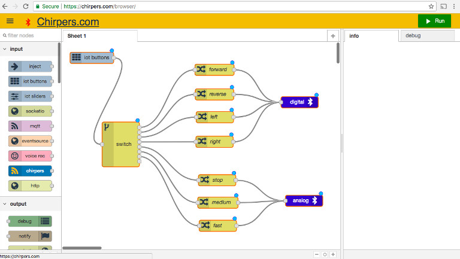

# Citrix Synergy  - Simply Serve

## Luis Montes and Moheeb Zara


[](https://www.youtube.com/watch?v=kKnn44NetFQ)


## Chirpers

[https://chirpers.com/browser](https://chirpers.com/browser)




## Our bots for today


* ESP32 - Micrcontroller
* L298N - Motor Driver
* Motors
* Chassis
* Batteries
* wheels
* Wires

## Web Bluetooth


* service Id: `bada5555-e91f-1337-a49b-8675309fb099`
* digital Characteristic `2a56`
* analog Characteristic `2a58`

[firmware](lolin32_synergy)
[service details](https://github.com/monteslu/ble-io/blob/master/service.md)

## Bot Assembly

* connect wheels
* connect fin
* connect breadboard bracket
* wiring
* customize your bot!
* connect battery pack


## Wiring


## Connecting to the bot

[https://chirpers.com/browser](https://chirpers.com/browser)

Import -> Examples -> synergy 2019 lolin32 oled bot

or copy and paste:

```javascript
[{"id":"G9ihNm2CSyU","type":"bluetooth out","z":"Punipf5yV3E","name":"digital / direction","deviceName":"","characteristicId":"2a56","bleServiceId":"bada5555-e91f-1337-a49b-8675309fb099","x":646.5000076293945,"y":468.80004596710205,"wires":[]},{"id":"OYC-sdySLAw","type":"bluetooth out","z":"Punipf5yV3E","name":"analog / speed","deviceName":"","characteristicId":"2a58","bleServiceId":"bada5555-e91f-1337-a49b-8675309fb099","x":658.5000076293945,"y":732.800045967102,"wires":[]},{"id":"1nu8lbyIEnA","type":"iot buttons","z":"Punipf5yV3E","x":90.00000762939453,"y":349.80004596710205,"wires":[["QDDvGIHyq-c"]]},{"id":"QDDvGIHyq-c","type":"switch","z":"Punipf5yV3E","name":"","property":"payload","propertyType":"msg","rules":[{"t":"eq","v":"2","vt":"num"},{"t":"eq","v":"10","vt":"num"},{"t":"eq","v":"5","vt":"num"},{"t":"eq","v":"7","vt":"num"},{"t":"eq","v":"6","vt":"num"},{"t":"eq","v":"4","vt":"num"},{"t":"eq","v":"8","vt":"num"},{"t":"eq","v":"12","vt":"str"}],"checkall":"true","outputs":8,"x":167.50000762939453,"y":581.800045967102,"wires":[["hZXVQYxLZt4"],["sN2hlGG-vLw"],["KZ3nNFvuqVs"],["7biqbIx0zkI"],["XFyAcAXWf8Q","c0z18ZM4j5c"],["vNVt9kMLmyk"],["0ler7QlFLjI"],["BKUpzsHsuoY"]]},{"id":"XFyAcAXWf8Q","type":"change","z":"Punipf5yV3E","name":"stop","rules":[{"t":"set","p":"payload","pt":"msg","to":"[0,0,0, 15,0,0]","tot":"json"}],"action":"","property":"","from":"","to":"","reg":false,"x":417.5000190734863,"y":689.799976348877,"wires":[["OYC-sdySLAw"]]},{"id":"0ler7QlFLjI","type":"change","z":"Punipf5yV3E","name":"medium","rules":[{"t":"set","p":"payload","pt":"msg","to":"[0,220,0, 15,220,0]","tot":"json"}],"action":"","property":"","from":"","to":"","reg":false,"x":419.5000190734863,"y":766.7999773025513,"wires":[["OYC-sdySLAw"]]},{"id":"BKUpzsHsuoY","type":"change","z":"Punipf5yV3E","name":"fast","rules":[{"t":"set","p":"payload","pt":"msg","to":"[0,255,255, 15,255,255]","tot":"json"}],"action":"","property":"","from":"","to":"","reg":false,"x":421.5000228881836,"y":806.7999792098999,"wires":[["OYC-sdySLAw"]]},{"id":"hZXVQYxLZt4","type":"change","z":"Punipf5yV3E","name":"forward","rules":[{"t":"set","p":"payload","pt":"msg","to":"[2, 1, 14, 0, 12, 1, 13, 0]","tot":"json"}],"action":"","property":"","from":"","to":"","reg":false,"x":418.50000762939453,"y":381.80004596710205,"wires":[["G9ihNm2CSyU"]]},{"id":"sN2hlGG-vLw","type":"change","z":"Punipf5yV3E","name":"reverse","rules":[{"t":"set","p":"payload","pt":"msg","to":"[2, 0, 14, 1, 12, 0, 13, 1]","tot":"json"}],"action":"","property":"","from":"","to":"","reg":false,"x":418.5000190734863,"y":421.8000726699829,"wires":[["G9ihNm2CSyU"]]},{"id":"KZ3nNFvuqVs","type":"change","z":"Punipf5yV3E","name":"left","rules":[{"t":"set","p":"payload","pt":"msg","to":"[2, 1, 14, 0, 12, 0, 13, 1]","tot":"json"}],"action":"","property":"","from":"","to":"","reg":false,"x":423.5000228881836,"y":533.7999744415283,"wires":[["G9ihNm2CSyU"]]},{"id":"7biqbIx0zkI","type":"change","z":"Punipf5yV3E","name":"right","rules":[{"t":"set","p":"payload","pt":"msg","to":"[2,0, 14, 1, 12,1, 13, 0]","tot":"json"}],"action":"","property":"","from":"","to":"","reg":false,"x":429.5000190734863,"y":578.7999753952026,"wires":[["G9ihNm2CSyU"]]},{"id":"c0z18ZM4j5c","type":"change","z":"Punipf5yV3E","name":"stop","rules":[{"t":"set","p":"payload","pt":"msg","to":"[2, 0, 14, 0, 12, 0, 13, 0]","tot":"json"}],"action":"","property":"","from":"","to":"","reg":false,"x":419.6000213623047,"y":479.00007343292236,"wires":[["G9ihNm2CSyU"]]},{"id":"vNVt9kMLmyk","type":"change","z":"Punipf5yV3E","name":"slow","rules":[{"t":"set","p":"payload","pt":"msg","to":"[0,190,0, 15,190,0]","tot":"json"}],"action":"","property":"","from":"","to":"","reg":false,"x":416.6000213623047,"y":729.0000743865967,"wires":[["OYC-sdySLAw"]]}]
```

Click the Run button and connect to YOUR bot!
(bot ID on bottom of breadboard)

## Controlling the bot

Switch to IOT Remote Buttons view in menu.


